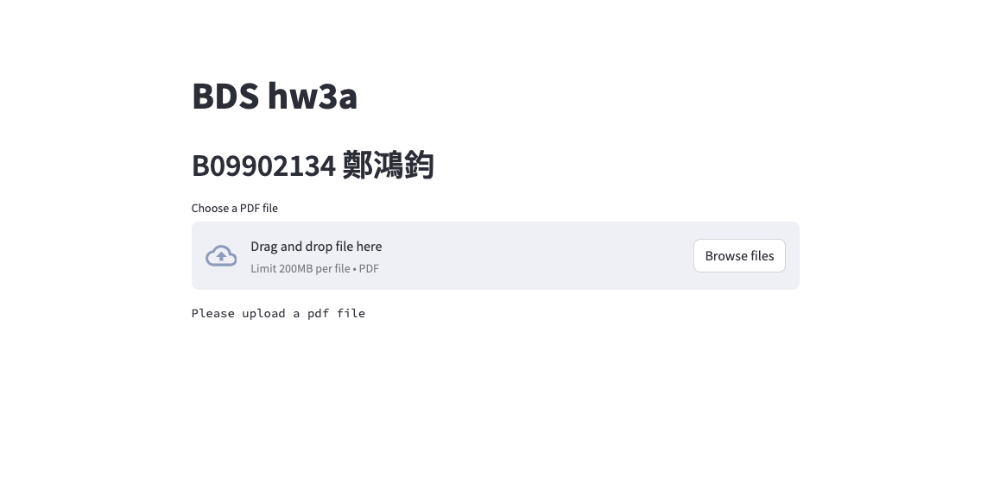
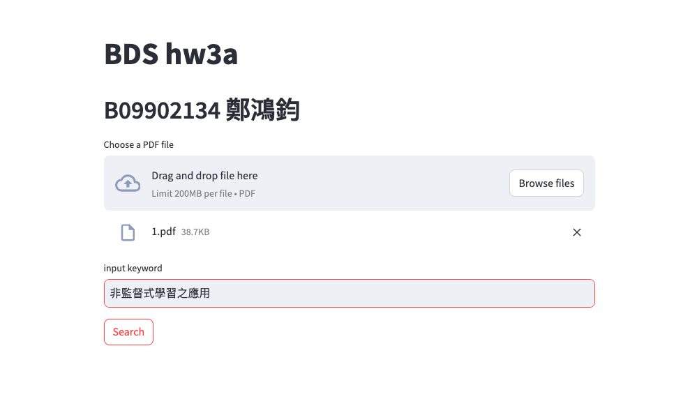
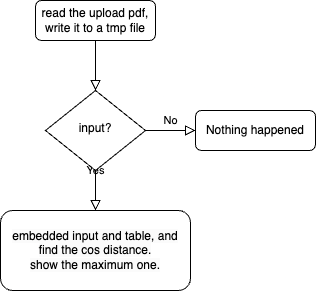

# Stage-A Document Intelligence

## Installation

```bash
conda create -n docint python=3.11
conda activate docint
conda install -c conda-forge ghostscript
pip install -r requirements.txt
```

## Usage
After previous step **installation**, we can run the app with following command
`streamlit run main.py`

## Steps
1. Open the browser to access the application (streamlit default run on `8501`)  and you will see the following.
  
2. Upload the pdf that only contains table (one pdf at a time) and the search bar will appear.
   
3. type the input inside search bar, make sure to **pressing enter** and waiting it run, then press the the search button below. if you didn't press enter correctly the result might not be the correct one, simply press the search button again may fix the problem.
4. if you want to change pdf then press the **x** at the right side of pdf and reupload one.

## Flowchart


